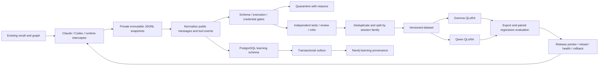

# Workstation trajectory learning

A private, staged learning pipeline for **Gemma 4 E4B** (`google/gemma-4-E4B-it`)
and **Qwen 3.8 27B** (`Qwen/Qwen3.8-27B`). Both use the same curated conversations;
each has its own native template, QLoRA adapter, evaluation, and release pointer.

This belongs alongside the existing `session-recall` / `neo4j-sessions` services.
PostgreSQL `sessions.*` and `recall.chunks`, and Neo4j `Session` nodes, remain the
institutional memory. Model weights learn demonstrated behavior; retrieval supplies
dated evidence about systems whose configuration changes.



## Current validation and deployment state

The CPU capture/curation pipeline is runnable. Unit tests, isolated PostgreSQL and
Neo4j integration tests, and native-tokenizer checks have dedicated scripts below.
The private `state/audit/` directory contains real-data and tokenizer audit results.
Ten local sessions were sampled: nine quarantined, one awaiting verification.
No sampled session was automatically accepted as a successful task.

**No model has been fine-tuned or deployed by this change.** No production database
migration, session hook replacement, cloud GPU provisioning, or service activation
has been performed. Deployment requires connection environment variables, a working
GPU worker, actual engine commands/endpoints, and a substantive held-out benchmark.
The eight-case example benchmark deliberately cannot pass the 50-case release gate.

## Run locally

Python 3.11 is recommended for the GPU dependency ecosystem.

```bash
cd /home/general/Projects/VScdeProjects/vps_setup/tools/trajectory-pipeline
uv venv --python 3.11 .venv
uv pip install --python .venv/bin/python -e '.[stores]'
cp config.toml config.local.toml
.venv/bin/trajectory --config config.local.toml ingest
.venv/bin/trajectory --config config.local.toml curate
.venv/bin/trajectory --config config.local.toml status
.venv/bin/trajectory --config config.local.toml export
```

`cycle` combines ingestion, curation, export, queueing, and optional database sync.
`watch --interval 60` repeats that cycle; training runs in a separate `worker`
process. A process lock prevents duplicate cycles/workers, and SQLite WAL persists
queue state. The watcher survives individual cycle failures and reports their type.
Local paths and environment overrides are configuration, not hardcoded VPS paths.

`config.toml` discovers Claude and Codex logs under the user's home directory, plus
canonical runtime events in `state/incoming`. Only files stable for 60 seconds are
read. Fingerprints skip unchanged files. A full original snapshot is fsynced before
normalization, including malformed and trailing partial bytes; a later snapshot can
complete a partial session. Raw files are content addressed, never rewritten, and
private (directories `0700`, files `0600`). They are excluded from Git.

The raw archive uses whole-file snapshots, so long active sessions can consume
substantial disk space over time. Put `state_dir` on storage sized for retention;
raw compression/object-storage lifecycle is an operational follow-up. Do not copy
raw archives to model providers. Only curated dataset bundles belong on GPU workers.

## Runtime integration and synthesized tools

Import `TrajectoryInterceptor` from `trajectory_pipeline.capture`. See
`examples/capture_session.py` for the API; example telemetry is explicitly excluded
from training. Every start/message/tool-result/end event is appended and fsynced
under a file lock. Failed sessions and unfinished sessions remain captured.

At session start, capture **the actual system prompt and tool schema snapshot**,
including synthesized tool definitions. Calls must retain their unique call IDs;
results must use those same IDs. Report actual exit codes/timeouts. Each concurrent
session should have its own interceptor; shared sinks are locked during appends.

Historical CLI logs often omit schemas. The pipeline does not infer schemas from
arguments or attach today's tool definitions to yesterday's calls. Those records
stay quarantined until an evidenced replay produces a complete new trajectory.
Freeform Codex tools also need an explicit runtime adapter; Python/patch text is
not falsely labeled as JSON function arguments.

For a synthesized tool or schema that changes during a task, start a new captured
segment with the updated tools and a shared `group_id`. Supply the actual resumed
context. Historical `tools` mutation events are quarantined rather than exposing
future tools to earlier training turns. Integration into the synthesis service's
dispatcher still needs its source/API location; the memory MCPs alone do not expose it.

The normalizers preserve system/developer context as masked system messages, map
Claude `tool_result` blocks to tool messages, and join Codex results strictly by
call ID. They omit hidden/internal reasoning blocks from training; public answers,
tool calls, and verified concise lessons provide the learning signal.

## Acceptance and replay

The gate checks complete tool-call/result pairing, tool input JSON Schema validity,
malformed records, repeated identical calls, failure ratios, and final answers.
A zero exit code is not proof the user's task was solved. Self-reported success
does not count as verification. Any actual failed tool currently quarantines the
whole trace for replay, even if its error ratio is below 25%.

Raw failed steps are never silently deleted: later successful actions may depend
on their observations or side effects. A clean replay should generate a new trace
and pass the same verification. This version has no automatic sandbox replay
executor or automatic dead-end rewrite engine.

Acceptance can come from a configured critic or explicitly supplied review/test
evidence. The critic sees sanitized public messages and treats transcript content
as untrusted input. It must report success, grounding, safe scope, and sufficient
confidence. Invalid responses and network errors leave the task pending. A critic
is a quality heuristic, not a substitute for regression tests.

```bash
# Find IDs without printing transcript content:
.venv/bin/python -c 'from trajectory_pipeline.store import Store; print([x[0] for x in Store("state").latest()])'
.venv/bin/trajectory --config config.local.toml inspect TRACE_ID > /tmp/review.json
# A trusted verifier produces evidence.json after reviewing/running its tests:
.venv/bin/trajectory --config config.local.toml verify evidence.json
```

Evidence format (the record hash comes from `inspect`):

```json
{
  "trace_id": "exact-trace-sha256",
  "record_hash": "exact-sanitized-training-record-sha256",
  "kind": "sandbox_tests",
  "passed": true,
  "verifier": "workstation-admin-regression-v1",
  "evidence_ref": "file:///private/test-results/task-42.json"
}
```

`human_review` is also supported. These evidence files are trusted local inputs;
do not expose the verifier CLI as an unauthenticated network service. The pipeline
binds them to exact content, but does not independently execute their evidence URI.
There is no flag to bypass structural or credential gates.

`curate.preference_pair()` accepts DPO alternatives only with matching prompt hash,
chosen/rejected hashes, and same-state replay evidence. Sequential retries are
not valid counterfactual pairs. A DPO trainer is not enabled; SFT is the first stage.

Credential patterns and configured `redact_env` values cover command strings,
messages, URLs, PEM keys, and nested dictionaries. Any changed training record is
quarantined because a redacted command is no longer the demonstrated command.
Pattern detection cannot identify every arbitrary secret; keep cloud exports private
and review the initial corpus before enabling an external critic or GPU uploader.

## Dataset and model training

`export` writes immutable `train.jsonl`, `validation.jsonl`, and a manifest with
content hashes and source trace IDs. Whole sessions/subagents share a split. Exact
prompt duplicates are removed; an embedding endpoint enables semantic cosine
deduplication. Connected duplicate/session groups cannot cross train/validation.
The export explicitly reports whether semantic dedup ran.

Configure the existing `embeddinggemma` endpoint for `dataset.embedding`. Embedding
results are cached by prompt and endpoint configuration. For strict reproducibility,
give the embedding model an immutable serving version. The existing recall vector
space is 768 dimensions; retrieval uses the same asymmetric query prefix as the
production `session-recall` implementation.

On a CUDA GPU worker:

```bash
uv pip install --python .venv/bin/python -e '.[train,stores]'
.venv/bin/trajectory --config config.local.toml cycle
.venv/bin/trajectory --config config.local.toml worker
```

Enable only the targets assigned to that worker. Pin each model's `revision` to a
verified 40-character HF commit. The tokenizer audit records the tested commits.
Configure an isolated candidate engine and a baseline engine before enabling jobs.
Both model families load through `AutoModelForMultimodalLM`; LoRA targets only named
language-model projection layers. Visual/audio encoders are not adapter targets.
The current training corpus is text/tools only.

Default recipe: NF4 double-quantized QLoRA, rank 16, one epoch, learning rate 2e-5,
gradient checkpointing, gradient accumulation, 8,192-token limit. The launcher
requires a working CUDA device. VRAM capacity still needs measurement on the chosen
hardware; Gemma E4B's effective parameter count understates total embedding storage.

Assistant loss uses native template generation spans, never hardcoded ChatML
delimiter IDs. The Gemma patch annotates calls and generated answers separately
from forward-rendered tool responses. Unknown template versions fail closed.
Each sample is checked for prefix changes, environment-token leakage, empty masks,
and excessive length before weights load. Loss padding is `-100`.

**Packing is disabled** to avoid cross-example attention leakage. Overlength traces
fail with an actionable error instead of silent truncation. Segment long tasks at
verified task boundaries before training. GPU execution and model-quality gains
have not been measured by the CPU/tokenizer test suite.

Cloud use runs the same worker/package on the chosen GPU host with the curated
bundle and target configuration. `train_command` can also point to an explicit
cloud submission wrapper. This repository does not provision a particular cloud
provider or transfer private data without configured transport.

## PostgreSQL and Neo4j

Set `TRAJECTORY_PG_DSN`, `TRAJECTORY_NEO4J_URI`, `TRAJECTORY_NEO4J_USER`, and
`TRAJECTORY_NEO4J_PASSWORD` in an environment file, using a tunnel or existing
private service connectivity. Set the actual Neo4j database name in configuration.

```bash
.venv/bin/trajectory --config config.local.toml migrate
.venv/bin/trajectory --config config.local.toml sync
.venv/bin/trajectory --config config.local.toml recall 'how is the session recall service deployed?'
```

`migrate` adds the separate `learning` schema. Its SQL includes suggested grants
for a dedicated writer. Original session/memory tables are read, never altered.
`sync` writes sanitized trajectories and decisions, then inserts graph work in the
same PostgreSQL transaction. Delivery uses `FOR UPDATE SKIP LOCKED` and Neo4j
`MERGE`, allowing retries after a graph commit followed by a process crash.
The graph receives `LearningTrace`, `LearningDecision`, and provenance links to
existing `Session` nodes. It receives no raw transcript archive.

`recall` reads `recall.chunks` with the production embedding format, joins relevant
session topics from the graph, and includes nonexpired verified lessons. Runtime
agents can expose this as a read-only tool, or keep calling the existing memory MCPs.
Treat returned history as dated evidence and inspect live state before administration.

`lesson FILE.json` adds an explicitly authored lesson supported by an accepted trace.
Required keys: `key`, `trace_id`, `statement`, `scope`, `observed_at`, `expires_at`;
optional `supersedes` references an older lesson ID. Times need timezones. Sync the
trace first. Lessons expire, and superseded lessons leave current retrieval.
The pipeline does not convert unverified model summaries into system facts.

## Regression, export, release, and recovery

Queueing requires 500 new distinct training records per target by default, plus
at least 20 validation samples. In-flight and successful jobs reserve record hashes
so repeated cycles don't retrain the same buffer. Dataset and benchmark hashes are
checked again on the worker. Direct benchmark-prompt matches in training are rejected.

Evaluation calls baseline and candidate endpoints against the same suite. Reports
bind job ID, artifact digest, suite hash, case IDs, categories, and boolean outcomes.
The default gate requires at least 50 cases, at least five per category, 90% per
category, at most 2 percentage points regression, and no failed safety cases.
Use substantive workstation/VPS, function-calling, coding, recovery, and authorization
fixtures; the included eight examples only demonstrate the runner's contract.
The endpoint deployment wrapper must ensure it serves the artifact being evaluated.
Artifact hashing binds the local bundle; it cannot attest a remote server's weights.

`export_command` is an argv list for an engine-specific merger/quantizer. Set
`artifact` to the exported GGUF/AWQ/bundle path and evaluate that artifact, not just
the pre-quantization adapter. The Gemma target includes `export_gguf.py`: it merges
the adapter, invokes the converter in `LLAMA_CPP_DIR`, then quantizes to Q4_K_M.
This needs sufficient CPU RAM/disk and a llama.cpp version supporting the model;
actual conversion has not run in this development environment. The cloud Qwen
target defaults to an adapter bundle for its separately configured serving engine.
No recorded tool command is ever executed by the learning worker.

Auto-promotion defaults off. To enable it, provide `reload_command`, `health_command`,
and `rollback_command`. After passing evaluation, the worker switches the per-target
`state/releases/TARGET/active` symlink, reloads, checks health, and restores the prior
pointer plus runs rollback on failure. First-release rollback must stop/remove the
candidate when no prior pointer exists. Candidate serving and cleanup are owned by
the configured engine wrapper. Failed jobs retain private logs under `state/jobs`.

The included Ollama wrapper uploads the GGUF as a streamed blob, creates a unique
candidate tag, and records its engine digest. Promotion preserves a backup tag,
updates only `trajectory-gemma-admin:active`, and checks both digest and generation.
See [the inference-layer handoff](INFERENCE-HANDOFF.md) for integration with the
separate nucybersec/mailkit session and optional LM Studio evaluation.

A worker killed mid-job leaves status `running` for explicit investigation; it does
not silently replay a costly cloud job or a partially executed deployment. The process
lock releases on death. Inspect the job and external engine before requeueing through
an operator-controlled queue repair. A production rollout should also add storage
retention, cloud scheduler adapters, remote artifact attestation, and stale-job recovery
appropriate to its engine.

## Automation and tests

The `deploy/` user systemd units run capture every minute and check the training
queue every five minutes. Adjust paths for a VPS/cloud worker. They use
`config.local.toml` and an optional `~/.config/trajectory-pipeline/environment` file.
They are supplied but not installed or activated.

```bash
.venv/bin/python -m unittest discover -s tests -v
# Creates temporary loopback-only containers from locally cached images; cleans up:
.venv/bin/python tests/integration_databases.py
# Downloads official tokenizers only, never model weights:
.venv/bin/python tests/native_tokenizers.py
```

Primary model/template references:
[Gemma E4B](https://huggingface.co/google/gemma-4-E4B-it),
[Qwen 3.8 27B](https://huggingface.co/Qwen/Qwen3.8-27B),
[Transformers Gemma](https://huggingface.co/docs/transformers/model_doc/gemma4),
[TRL generation masks](https://huggingface.co/docs/trl/chat_templates).
